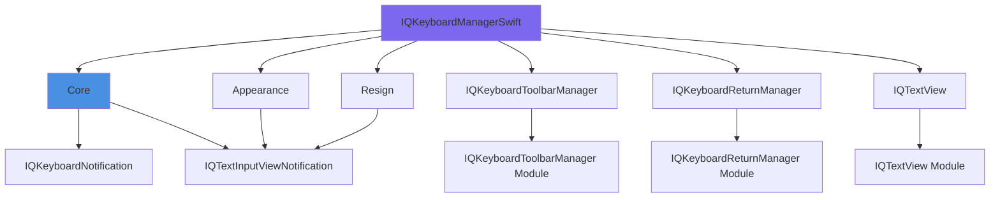

## Overview

IQKeyboardManager uses a modular architecture that allows you to include only the features you need. When installed via CocoaPods, the library is split into multiple subspecs that can be included independently.

<Note>
When using Swift Package Manager (SPM), all modules are included by default. The subspec system is specific to CocoaPods installations.
</Note>

## Architecture Diagram



## Default Installation

By default, all subspecs are included:

```ruby
pod 'IQKeyboardManagerSwift'
```

This installs:
- Core
- Appearance
- IQKeyboardToolbarManager
- IQKeyboardReturnManager
- IQTextView
- Resign

## Core Subspecs

### Core (Required)

The fundamental keyboard management functionality.

**Source Files:** `IQKeyboardManagerSwift/IQKeyboardManager/**/*.{swift}`

**Features:**
- Main `IQKeyboardManager` class
- Position adjustment logic
- View hierarchy traversal
- Configuration system (IQActiveConfiguration, IQRootControllerConfiguration, IQScrollViewConfiguration)
- UIView extensions (`.iq` namespace)
- ScrollView handling
- Internal utilities

**Dependencies:**
- `IQKeyboardNotification` - Keyboard event observing
- `IQTextInputViewNotification` - Text field/text view focus tracking

**Installation:**
```ruby
pod 'IQKeyboardManagerSwift/Core'
```

**Usage:**
```swift
import IQKeyboardManagerSwift

IQKeyboardManager.shared.isEnabled = true
IQKeyboardManager.shared.keyboardDistance = 15.0
```

<Warning>
The Core subspec must be included for IQKeyboardManager to function. All other subspecs depend on or extend Core functionality.
</Warning>

### Appearance

Keyboard appearance customization functionality.

**Source Files:** `IQKeyboardManagerSwift/Appearance/**/*.{swift}`

**Features:**
- `IQKeyboardAppearanceManager` - Central appearance coordinator
- `IQKeyboardAppearanceConfiguration` - Appearance settings storage
- Automatic keyboard appearance matching
- Overrides UITextField/UITextView keyboard appearance

**Dependencies:**
- `IQTextInputViewNotification`

**Installation:**
```ruby
pod 'IQKeyboardManagerSwift/Appearance'
```

**Key Classes:**

```swift
// IQKeyboardAppearanceManager.swift
@MainActor
public final class IQKeyboardAppearanceManager {
    public static let shared: IQKeyboardAppearanceManager
    
    // Enable appearance management
    public var isEnabled: Bool
    
    // Override keyboard appearance
    public var overrideAppearance: Bool
}
```

**Usage:**
```swift
import IQKeyboardManagerSwift

// Enable appearance matching
IQKeyboardAppearanceManager.shared.isEnabled = true

// Force dark keyboard
IQKeyboardAppearanceManager.shared.overrideAppearance = true
```

### IQKeyboardToolbarManager

Toolbar with Previous/Next/Done buttons above the keyboard.

**Source Files:** `IQKeyboardManagerSwift/IQKeyboardToolbarManager/**/*.{swift}`

**Features:**
- Automatic toolbar with navigation buttons
- Previous/Next navigation between text fields
- Done button to dismiss keyboard
- Customizable toolbar appearance
- Integration with IQKeyboardManager

**Dependencies:**
- `IQKeyboardToolbarManager` (external module)

**Installation:**
```ruby
pod 'IQKeyboardManagerSwift/IQKeyboardToolbarManager'
```

**Integration:**

```swift
// Accessed via IQKeyboardManager extension
import IQKeyboardManagerSwift

// Enable toolbar
IQKeyboardManager.shared.enableToolbar = true

// Customize toolbar
IQKeyboardManager.shared.toolbarConfiguration.useTextFieldTintColor = true
IQKeyboardManager.shared.toolbarConfiguration.placeholderConfiguration.showPlaceholder = true
```

<Accordion title="Toolbar Manager Features">
The toolbar manager provides:

- **Previous/Next buttons** - Navigate between text fields in responder chain
- **Done button** - Dismiss keyboard
- **Title label** - Optional placeholder text display
- **Customization** - Tint colors, fonts, button items
- **Automatic management** - Enables/disables buttons based on responder chain

The toolbar is automatically added to text fields when enabled and removed when disabled.
</Accordion>

### IQKeyboardReturnManager

Automatic keyboard return key handling.

**Source Files:** Bridge to external module

**Features:**
- Automatic return key handling
- Move to next field on return key
- Submit form on last field
- Customizable return key types
- Integration with responder chain

**Dependencies:**
- `IQKeyboardReturnManager` (external module)

**Installation:**
```ruby
pod 'IQKeyboardManagerSwift/IQKeyboardReturnManager'
```

**Usage:**

```swift
import IQKeyboardManagerSwift

// Enable return key management
IQKeyboardManager.shared.enableReturnKeyHandler = true

// Customize behavior
textField.returnKeyType = .next    // Shows "Next"
lastField.returnKeyType = .done    // Shows "Done"
```

The return key manager automatically:
1. Sets appropriate return key types (Next/Done)
2. Moves to next field when return is tapped
3. Dismisses keyboard on last field

### IQTextView

Enhanced UITextView with placeholder support.

**Source Files:** Bridge to external module

**Features:**
- Built-in placeholder support
- Matches UITextField placeholder behavior
- Customizable placeholder appearance
- Automatic placeholder hiding/showing

**Dependencies:**
- `IQTextView` (external module)

**Installation:**
```ruby
pod 'IQKeyboardManagerSwift/IQTextView'
```

**Usage:**

```swift
import IQTextView

let textView = IQTextView()
textView.placeholder = "Enter your message..."
textView.placeholderTextColor = .lightGray
```

<Note>
IQTextView is a standalone module that works independently of IQKeyboardManager but is commonly used together for enhanced text input functionality.
</Note>

### Resign

Keyboard dismissal by tapping outside text fields.

**Source Files:** `IQKeyboardManagerSwift/Resign/**/*.{swift}`

**Features:**
- `IQKeyboardResignHandler` - Manages tap-to-dismiss
- Automatic gesture recognizer management
- Configurable dismiss behavior
- Integration with IQKeyboardManager

**Dependencies:**
- `IQTextInputViewNotification`

**Installation:**
```ruby
pod 'IQKeyboardManagerSwift/Resign'
```

**Key Classes:**

```swift
// IQKeyboardResignHandler.swift
@MainActor
public final class IQKeyboardResignHandler {
    public static let shared: IQKeyboardResignHandler
    
    // Enable resign on touch outside
    public var isEnabled: Bool
    
    // Resign on toolbar touch outside
    public var resignOnTouchOutside: Bool
}
```

**Integration:**

```swift
import IQKeyboardManagerSwift

// Enable tap-to-dismiss
IQKeyboardManager.shared.resignOnTouchOutside = true

// Disable for specific view controllers
IQKeyboardManager.shared.disabledResignFirstResponderClasses.append(
    ChatViewController.self
)
```

## Selective Installation

### Minimal Installation

Install only core keyboard management:

```ruby
pod 'IQKeyboardManagerSwift/Core'
```

This gives you:
- Position adjustment
- Keyboard distance handling
- Basic configuration
- No toolbar, no appearance, no resign

### Core + Toolbar

Most common configuration for form-heavy apps:

```ruby
pod 'IQKeyboardManagerSwift/Core'
pod 'IQKeyboardManagerSwift/IQKeyboardToolbarManager'
```

### Core + Resign

For apps that want tap-to-dismiss without toolbar:

```ruby
pod 'IQKeyboardManagerSwift/Core'
pod 'IQKeyboardManagerSwift/Resign'
```

### Custom Combination

Mix and match based on needs:

```ruby
pod 'IQKeyboardManagerSwift/Core'
pod 'IQKeyboardManagerSwift/Appearance'
pod 'IQKeyboardManagerSwift/IQTextView'
# Exclude toolbar and return manager
```

## Subspec Dependencies

### Dependency Tree

```
IQKeyboardManagerSwift
├── Core
│   ├── IQKeyboardNotification (external)
│   └── IQTextInputViewNotification (external)
├── Appearance
│   └── IQTextInputViewNotification (external)
├── IQKeyboardToolbarManager
│   └── IQKeyboardToolbarManager (external)
├── IQKeyboardReturnManager
│   └── IQKeyboardReturnManager (external)
├── IQTextView
│   └── IQTextView (external)
└── Resign
    └── IQTextInputViewNotification (external)
```

### External Dependencies

IQKeyboardManager relies on these external modules:

**IQKeyboardNotification** (v1.0.6+)
- Observes keyboard show/hide/change notifications
- Provides animation synchronization
- Used by: Core

**IQTextInputViewNotification** (v1.0.9+)
- Tracks text field/text view focus changes
- Monitors begin/end editing events
- Used by: Core, Appearance, Resign

**IQKeyboardToolbarManager** (v1.1.4+)
- Complete toolbar implementation
- Button management and responder chain
- Used by: IQKeyboardToolbarManager subspec

**IQKeyboardReturnManager** (v1.0.6+)
- Return key handling logic
- Responder chain navigation
- Used by: IQKeyboardReturnManager subspec

**IQTextView** (v1.0.5+)
- UITextView with placeholder
- Standalone text view enhancement
- Used by: IQTextView subspec

## Podspec Configuration

### Full Podspec Structure

```json
{
  "name": "IQKeyboardManagerSwift",
  "version": "8.0.2",
  "subspecs": [
    {
      "name": "Core",
      "source_files": ["IQKeyboardManagerSwift/IQKeyboardManager/**/*.{swift}"],
      "dependencies": {
        "IQKeyboardNotification": [],
        "IQTextInputViewNotification": []
      }
    },
    {
      "name": "Appearance",
      "source_files": ["IQKeyboardManagerSwift/Appearance/**/*.{swift}"],
      "dependencies": {
        "IQTextInputViewNotification": []
      }
    },
    {
      "name": "IQKeyboardToolbarManager",
      "source_files": ["IQKeyboardManagerSwift/IQKeyboardToolbarManager/**/*.{swift}"],
      "dependencies": {
        "IQKeyboardToolbarManager": []
      }
    },
    {
      "name": "IQKeyboardReturnManager",
      "dependencies": {
        "IQKeyboardReturnManager": []
      }
    },
    {
      "name": "IQTextView",
      "dependencies": {
        "IQTextView": []
      }
    },
    {
      "name": "Resign",
      "source_files": ["IQKeyboardManagerSwift/Resign/**/*.{swift}"],
      "dependencies": {
        "IQTextInputViewNotification": []
      }
    }
  ],
  "default_subspecs": [
    "Core",
    "Appearance", 
    "IQKeyboardToolbarManager",
    "IQKeyboardReturnManager",
    "IQTextView",
    "Resign"
  ]
}
```

### Default Subspecs

The `default_subspecs` array defines what's included with:

```ruby
pod 'IQKeyboardManagerSwift'
```

All six subspecs are included by default for maximum functionality.

## Swift Package Manager

When using SPM, subspecs don't apply. Install via Package.swift:

```swift
dependencies: [
    .package(
        url: "https://github.com/hackiftekhar/IQKeyboardManager.git", 
        from: "8.0.2"
    )
]
```

SPM automatically includes all dependencies:

```swift
.target(
    name: "YourTarget",
    dependencies: [
        "IQKeyboardManagerSwift",
        "IQKeyboardNotification",
        "IQTextInputViewNotification",
        "IQKeyboardToolbarManager",
        "IQKeyboardReturnManager",
        "IQTextView"
    ]
)
```

<Note>
Swift Package Manager doesn't support the concept of subspecs. All modules are included as separate package products that you can import individually.
</Note>

## Choosing Subspecs

### When to Use Each Subspec

| Subspec | Use When | Skip When |
|---------|----------|-----------|
| **Core** | Always (required) | Never |
| **Appearance** | You want automatic keyboard appearance matching | You manually set keyboard appearance |
| **IQKeyboardToolbarManager** | You have forms with multiple fields | Single field apps, custom navigation |
| **IQKeyboardReturnManager** | You want automatic return key handling | You handle return keys manually |
| **IQTextView** | You need UITextView with placeholders | You use only UITextField |
| **Resign** | You want tap-outside-to-dismiss | You dismiss keyboard programmatically |

### Optimization Strategies

**Minimize Binary Size**

```ruby
# Smallest installation
pod 'IQKeyboardManagerSwift/Core'
```

**Forms & Navigation**

```ruby
# Perfect for form-heavy apps
pod 'IQKeyboardManagerSwift/Core'
pod 'IQKeyboardManagerSwift/IQKeyboardToolbarManager'
pod 'IQKeyboardManagerSwift/IQKeyboardReturnManager'
```

**Chat Apps**

```ruby
# Chat with rich text input
pod 'IQKeyboardManagerSwift/Core'
pod 'IQKeyboardManagerSwift/IQTextView'
pod 'IQKeyboardManagerSwift/Resign'
```

**Simple Apps**

```ruby
# Basic functionality with resign
pod 'IQKeyboardManagerSwift/Core'
pod 'IQKeyboardManagerSwift/Resign'
```

## Migration from Objective-C

If migrating from the Objective-C version (`IQKeyboardManager`), note:

1. **Different pod name:** `IQKeyboardManagerSwift` vs `IQKeyboardManager`
2. **Subspec structure:** Swift version has modular subspecs
3. **Import statements:** `import IQKeyboardManagerSwift`

```ruby
# Old Objective-C
pod 'IQKeyboardManager'

# New Swift
pod 'IQKeyboardManagerSwift'
```

## Best Practices

### 1. Start with Default Installation

Begin with full installation during development:

```ruby
pod 'IQKeyboardManagerSwift'
```

### 2. Profile and Optimize

After development, profile your app and remove unused subspecs:

```ruby
# Remove subspecs you don't use
pod 'IQKeyboardManagerSwift/Core'
pod 'IQKeyboardManagerSwift/Resign'
# Removed: Appearance, Toolbar, Return, TextView
```

### 3. Document Subspec Choices

Add comments explaining why subspecs were excluded:

```ruby
# Core keyboard management only
pod 'IQKeyboardManagerSwift/Core'

# Excluded:
# - Appearance: We set keyboard appearance manually per brand guidelines
# - Toolbar: Custom keyboard accessory view used instead
# - Return: Single-field screens don't need return key handling
# - TextView: App uses UITextField exclusively
# - Resign: Keyboard dismissed via custom button
```

### 4. Keep Dependencies Updated

Regularly update external dependencies:

```ruby
pod update IQKeyboardManagerSwift
pod update IQKeyboardNotification
pod update IQTextInputViewNotification
```

### 5. Test Subspec Combinations

Test your specific subspec combination thoroughly:

```swift
// Ensure required functionality works
IQKeyboardManager.shared.isEnabled = true
// Test position adjustments
// Verify no missing features
```

## Troubleshooting

### Missing Functionality

**Problem:** Feature not available after selective installation

**Solution:** Check if the feature is in an excluded subspec

```ruby
# Add the required subspec
pod 'IQKeyboardManagerSwift/IQKeyboardToolbarManager'
```

### Duplicate Symbols

**Problem:** Linker errors with duplicate symbols

**Solution:** Don't mix default and selective installation

```ruby
# ❌ Wrong: Installs subspecs twice
pod 'IQKeyboardManagerSwift'
pod 'IQKeyboardManagerSwift/Core'

# ✅ Correct: Choose one approach
pod 'IQKeyboardManagerSwift/Core'
pod 'IQKeyboardManagerSwift/Resign'
```

### Import Errors

**Problem:** Cannot import subspec-specific classes

**Solution:** Always import the main module

```swift
// ✅ Correct
import IQKeyboardManagerSwift

// ❌ Wrong (subspecs aren't separate modules)
import IQKeyboardManagerCore
```

## Next Steps

<CardGroup cols={2}>
  <Card title="Installation" icon="download" href="/getting-started/installation">
    Learn how to install IQKeyboardManager
  </Card>
  <Card title="Configuration" icon="gear" href="/core/configuration">
    Configure IQKeyboardManager for your app
  </Card>
</CardGroup>
